## Using the theme

You will notice that inside the `<head>` class of the `html` files I add the following:
```html
<head>
	<meta charset="utf-8">
	<meta name="viewport" content="width=device-width, initial-scale=1.0, maximum-scale=1.0, user-scalable=no">

	<title>My awesome presentation</title>

	<!-- Reveal themes -->
	<link rel="stylesheet" href="reveal.js/css/reveal.css">
	<link rel="stylesheet" href="reveal.js/css/theme/white.css">

	<!-- Full theme:light version -->
	<link rel="stylesheet" href="css/dark_theme.css">
	<link rel="stylesheet" href="sass/presentation.css">

	<!-- Theme used for syntax highlighting of code -->
	<link rel="stylesheet" href="css/syntax/colorbrewer_syntax.css">

	<!-- Favicon -->
	<link rel="icon" href="./assets/personal/Purple.png" />

	<!-- Font awesome -->
	<link href="https://use.fontawesome.com/releases/v5.0.8/css/all.css" rel="stylesheet" media="all">

	<!-- Uncomment for printing -->
	<!-- <script src="reveal.js/js/reveal-print.js"></script> -->

</head>
```

These are the stylesheets needed for the slides, depending on the colour schemes you want you should use the `href="css/light_theme.css"` or the `href="css/dark_theme.css"`.


The syntax highlighting style is defined as:
```html
<!-- Theme used for syntax highlighting of code -->
<link rel="stylesheet" href="css/syntax/google_syntax.css">
```
I use a number of styles depending on what I want to achieve, all which come from [highlight.js](https://highlightjs.org/)

### Parts forming the themes
I have written the styles in such a way that you can choose a colour palette, background pattern, and font combinations independently. To do so you need to specify the appropriate values within the html as:

```html
<!-- Need to specify the theme here: the first defines the color palette and the 
	second the font theme -->

<body class="theme-lines theme-dosis-font">

	<!-- Adding the background theme here -->

	<div class="reveal pattern--lines">
```

### Sample themes combinations

```
<body class="theme-lines theme-dosis-font">
<div class="reveal pattern--fox">
```

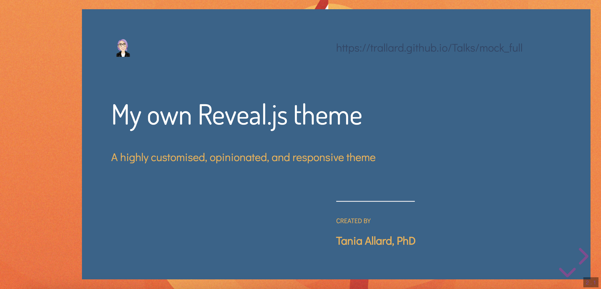


```
<body class="theme-streams theme-leafy-font">
<div class="reveal pattern--stream">
```

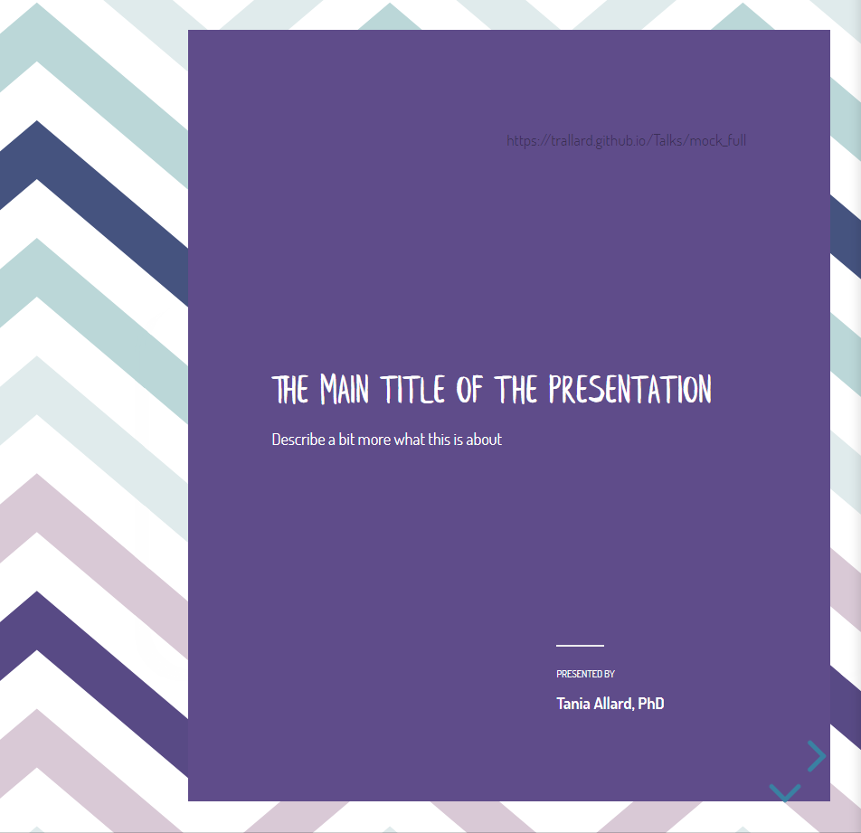


```
<body class="theme-seacalm theme-dosis-font">
<div class="reveal pattern--hex">
```


```
<body class="theme-goldilocks theme-allmono-font">
<div class="reveal pattern--stars">
```


```
<body class="theme-soda theme-soda-font">
<div class="reveal pattern--hex">
```


```
<body class="theme-jewels theme-nox-font">
<div class="reveal pattern--pupilines">
```


---

## Palettes
Each colour palette has a primary, secondary, and third colour (as well as a lighter version of the 
primary and secondary)

### Light themes palettes
These have a white base for the slides background  and the accent colours as shown in the images

#### duotone
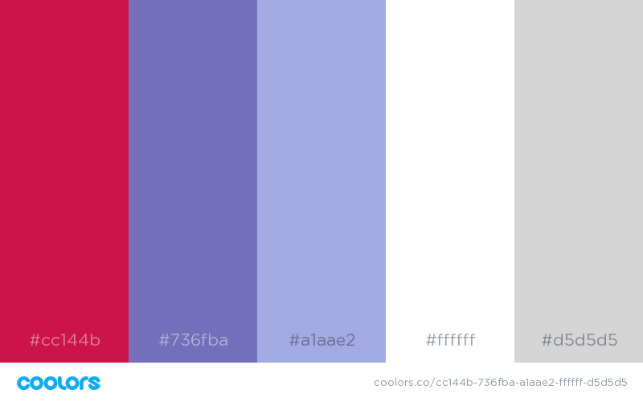

#### goldilocks
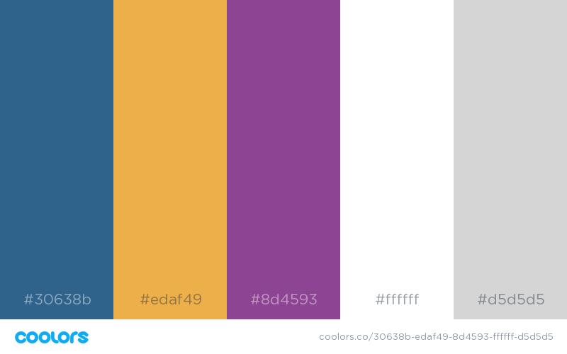

#### jewels
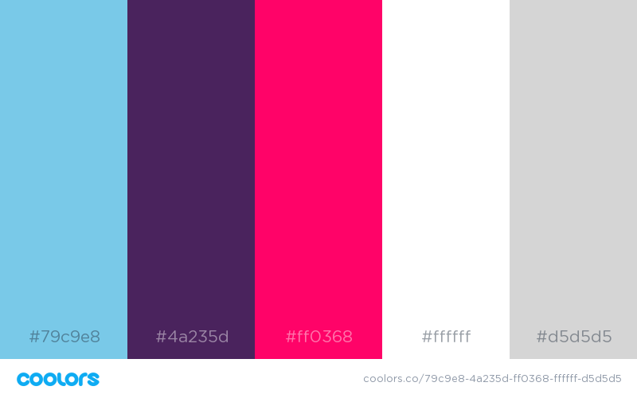

#### lines
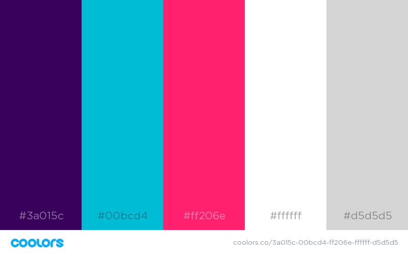

#### seacalm
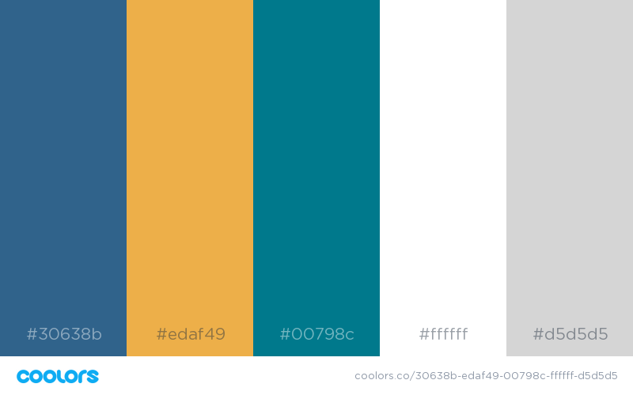

#### soda
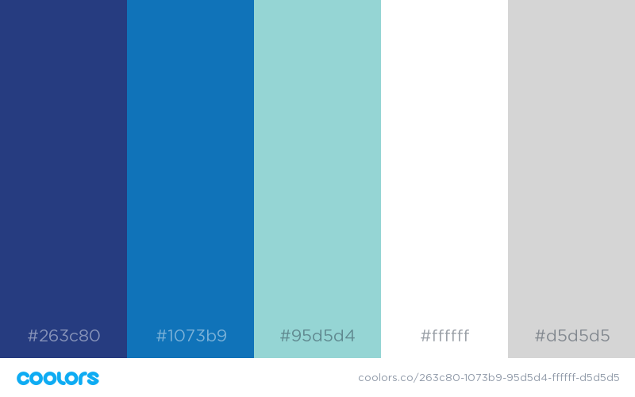

#### streams
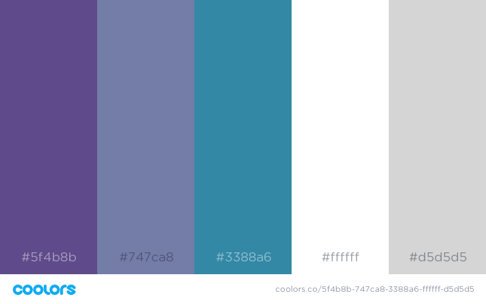


### Dark themes palettes

#### sedona
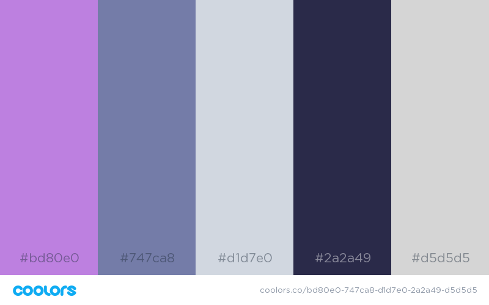

#### cyber
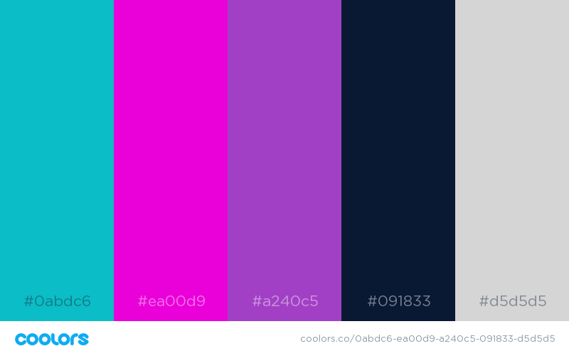

#### bright-blue
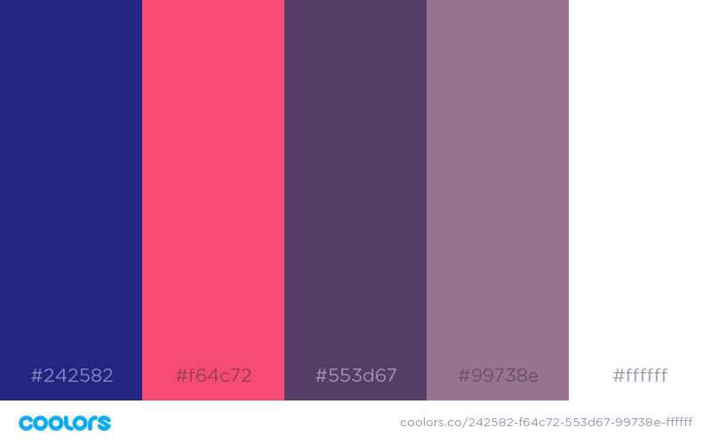

#### candy
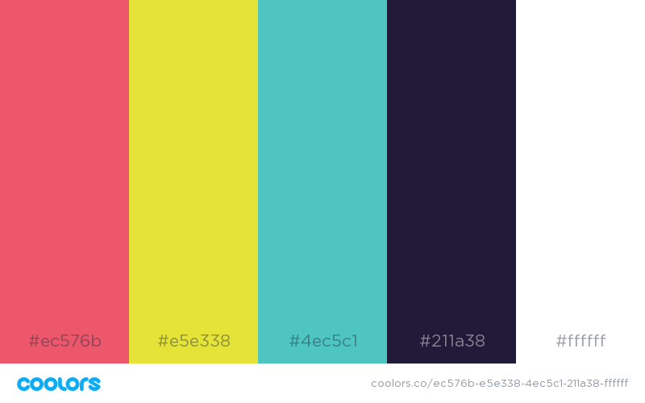

---
## Backgrounds

- bupulines


- bwlines


- cubes


- gatsbyblue


- gatsby


- hexgray


- hex


- lines


- pupilines


- starpattern


- zigzag


-floral


---
For a full demo of a light coloured slide check
[https://bitsandchips.me/mock_full.html](https://bitsandchips.me/mock_full.html)

The commented source for the demo slides is [mock_full.html](mock_full.html)
